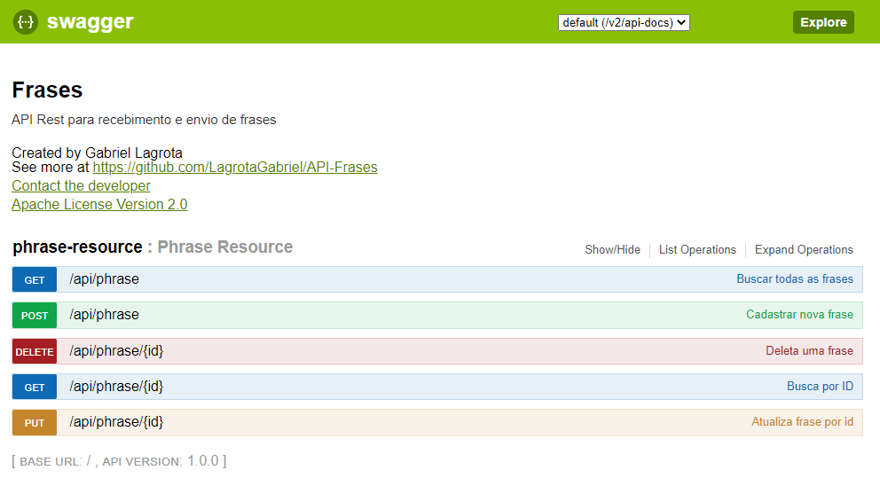

# API Frases
API Que realiza salvamento e busca de frases em banco de dados

## Tópicos

- [Fluxo](#fluxo)
- [Funcionalidades](#funcionalidades)
- [Swagger](#swagger)
- [End Points](#end-points)
- [Modelo de JSON](#modelo-de-json)
- [Testes unitários](#testes-unitários)
- [Tecnologias utilizadas](#tecnologias-utilizadas)
- [Acesso ao projeto](#acesso-ao-projeto)
- [Abrir e rodar o projeto](#abrir-e-rodar-o-projeto)
- [Desenvolvedor](#desenvolvedor)

## Fluxo

1. O usuário envia uma requisição para a API;
2. O Controller recebe a requisição;
3. O Controller irá encaminhar para a camada de serviços, que irá realizar as validações e os processamentos lógicos;
4. A camada de serviços irá enviar para a camada de acesso de dados, que irá converter os objetos recebidos do tipo 
PhraseDTO em objetos do tipo PhraseEntity para que sejam persistidos ou consultados na camada do banco de dados;
5. Ao sair da camada de persistência, o objeto é convertido para um objeto do tipo PhraseDTO, e é encaminhado novamente
para o controller, que irá devolver uma response para o usuário de acordo com o resultado do processamento.

## Funcionalidades

:heavy_check_mark: `Criação e edição de frases:` A API possibilita o cadastro e a edição de frases a nível de banco de
dados;

:heavy_check_mark: `Busca por frases cadastradas:` A API possibilita a busca de frases cadastradas no banco de dados, tanto
por id como uma busca geral.

## Swagger

> Para acessar o swagger basta acessar o endpoint /swagger-ui.html

`Tela principal do Swagger`


## End points

> [GET] findAll: api/phrase<br>
Busca por todas as operações já realizadas no banco de dados

> [GET] findById: api/phrase/{id}<br>
Busca uma operação por id no banco de dados

> [POST] create: api/phrase<br>
Cria uma nova operação no banco de dados
 
>[PUT] updateById: api/phrase/{id}<br>
Altera uma frase no banco de dados

>[DELETE] deleteById: api/phrase/{id}<br>
Deleta uma frase no banco de dados

## Modelo de JSON

:warning: Modelo de JSON para requisição via POST e/ou PUT

```json
{
   "frase": "Exemplo de frase"
}
```

## Testes unitários

> Os testes unitários foram concluídos com cobertura de testes de 93% das linhas do projeto

`Relatório de cobertura de testes`


## Tecnologias Utilizadas

- Java 8
- Swagger
- MySql
- JPA
- Mockito
- Insomnia
- Spring MVC
- Lombok
- J Unit

## Acesso ao projeto
O projeto está disponibilizado para utilização gratuita e ilimitada na url:<br>
https://api-cadastrofrases.herokuapp.com <br>
Podendo ser acessado pelo swagger pela url: <br>
https://api-cadastrofrases.herokuapp.com/swagger-ui.html


## Abrir e rodar o projeto
1. Para rodar o projeto basta utilizar o git clone com a url:<br>https://github.com/LagrotaGabriel/API-Frases.git
2. Em seguida, recomenda-se que configure o arquivo `application.properties` com o código abaixo para configuração da persistência do projeto
   ```java 
   server.port = 8080
   spring.mvc.pathmatch.matching-strategy=ant-path-matcher
   spring.datasource.url=jdbc:mysql://localhost:3306/db?useTimezone=true&serverTimezone=UTC
   spring.datasource.username=root
   spring.datasource.password=123456
   spring.jpa.hibernate.ddl-auto=update
   spring.jpa.show-sql=true
   spring.jpa.properties.hibernate.dialect=org.hibernate.dialect.MySQL5InnoDBDialect
3. Após configurar o `application.properties`, sugiro que você crie um schema no mysql com o nome db
4. Execute o código e acesse o projeto rodando em servidor local pela url http://www.localhost:8080

## Desenvolvedor
[<br><sub>Gabriel Lagrota</sub>](https://github.com/LagrotaGabriel)